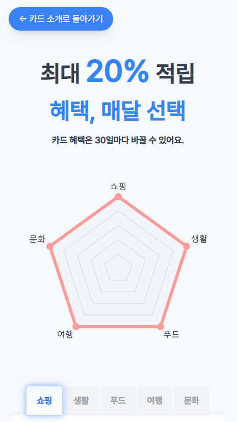
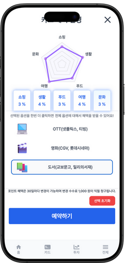
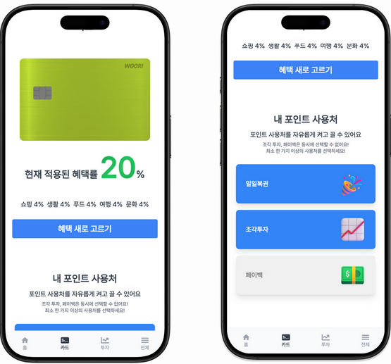
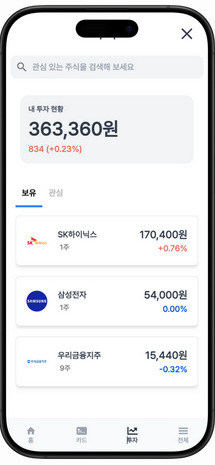
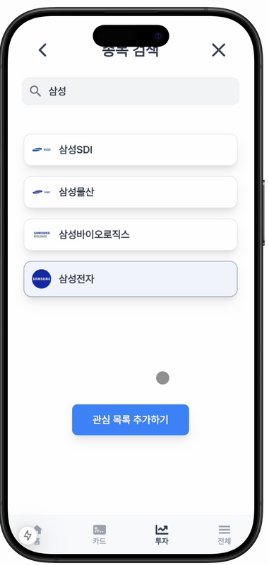
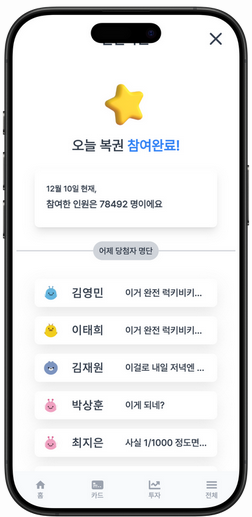
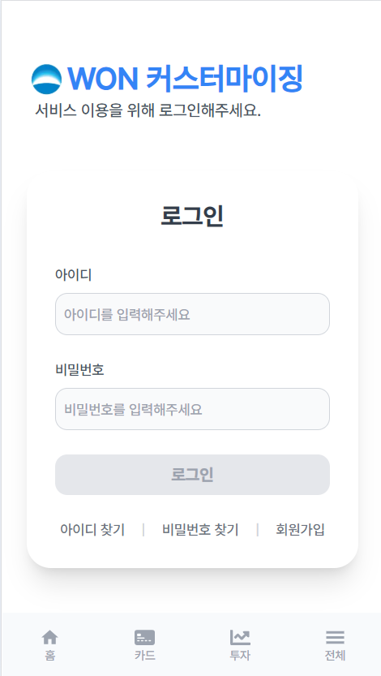

# 📌 Quostomize-fe: 우리 커스터마이징
## 📝 프로젝트 소개

**우리 커스터마이징(QUOSTOMIZE)** 은 사용자가 매달 자신의 생활 패턴과 취향에 맞게 카드 혜택과 포인트 사용처를 직접 선택할 수 있는 서비스입니다.

**사용자가 직접 결정하는 맞춤형 혜택 제공**을 통해 기존 카드 서비스의 한계를 뛰어넘고, 변화하는 소비 트렌드에 유연하게 대응합니다.

### 👉🏻 [시연영상 바로가기](https://youtu.be/4sCnBonI3yI)
### 👉🏻 [사이트 바로가기](https://quostomizecard.site/home)
<br>

## 🚀 주요 설계 방향 
본 프로젝트는 **서비스 보안**과 **안정성 강화**를 주요 설계 방향으로 두고 개발되었습니다.

**1. 보안과 안정성 강화**
  - Next.js + Auth.js
    - 토큰을 브라우저 쿠키 대신 서버 세션에 저장하여 데이터 직접 노출 방지
  - Next.js API Route
    - 클라이언트-백엔드 간 직접 통신을 차단해 헤더 정보 및 API 주소 보호
  - JWT 보안 강화
    - 비밀번호는 단방향 암호화, 개인정보는 양방향 암호화 적용
    - Acess/Refresh Token 검증 및 Blacklist 로직 추가로 보안 수준 향상

**2. 멱등성 적용**
  - Redis를 활용한 멱등키 관리로 카드 생성 요청 중복 처리 방지
  - 동일한 요청은 캐시된 응답 반환으로 효율성과 안정성 확보

**3. 대량 데이터 처리**
  - 배치 프로세스: 복권 응모 데이터를 매일 정해진 시간에 처리
    - Redaer: 1000명 데이터 읽어오기
    - Processor: 응모자 중 당첨자 선정
    - Writer: 당첨 결과 기록

**4. 코드 품질 관리**
  - SonarQube를 통한 정적 코드 분석으로 코드 품질 유지
  - DB Lock으로 동시성 문제 해결
  - 비동기 처리 강화로 안정적인 예외 처리 구현

<br>

## 🔧 주요 기능
**1. 카드 혜택 - 혜택 선택의 자유**
   - 상위분류 혜택: 5가지 상위분류 선택 시 모든 가맹점에서 3% 적립
   - 맞춤형 혜택: 세부 가맹점 그룹 선택 시 최대 4% 적립
   - 유연한 변경: 30일마다 혜택 변경 가능

**2. 포인트 사용처 - 포인트 사용의 다양성**
   - 페이백: 카드 결제일에 포인트를 현금처럼 사용
   - 조각투자: 원하는 주식을 설정하고 포인트로 주식 매수
   - 일일복권: 매일 자정 추첨으로 최대 1만 포인트 지급

<br>

## 📱화면

| 메인 페이지                                                                                                                  | 상세 혜택 페이지                                                                                                    |
| ------------------------------------------------------------------------------------------------------------------------------ | ----------------------------------------------------------------------------------------------------------------- |
| <p align="center"> **메인 페이지** </p>                             | <p align="center"> **상세 혜택 페이지** </p>    |
| 혜택 변경 페이지                                                                                                                     | 포인트 사용 방식 변경                                                                                                       |
| <p align="center"> **포인트 적립 방식 변경** </p>              | <p align="center"> **포인트 사용 방식 변경** </p> |
| 현재 내 주각투자 현황                                                                                                                       | 종목 검색 및 선호 종목 설정                                                                                                          |
|  <p align="center"> **보유 주식 현황** </p>                          | <p align="center"> **장소 검색** </p>              |
| 일일복권                                                                                                                  | 로그인페이지                                                                                                            |
| <p align="center"> **일일복권** </p> | <p align="center"> **로그인 페이지** </p>                              |

<br>

## ⚙️ 기술 스택
- 
<br>

## 🌐 배포 파이프라인
관리자 페이지는 Vercel을 이용해 배포를 진행하였습니다. Vercel 대시보드를 통해 배포 상태를 한눈에 확인할 수 있습니다.
<br>

**배포 과정**
1. 커밋 푸시: Github에 브랜치로 푸시합니다.
2. Vercel 배포: 메인 브랜치 병합 후 Vercel에 배포합니다.
3. 실시간 업데이트: Vercel을 통해 관리자 사이트가 즉시 업데이트됩니다.
<br>

## 🗂️ 주요 폴더 구조
**프론트엔드**
```
root/
├── app/
│   ├── (fullscreen)/
│   │   ├── card-benefit-details/
│   │   ├── create-card/
│   │   ├── my-page/
│   │   ├── sign-up/
│   │   └── layout.jsx
│   ├── (nav)/
│   │   ├── benefit-change/
│   │   ├── find-id/
│   │   ├── find-password/
│   │   ├── home/
│   │   ├── login/
│   │   ├── lotto/
│   │   ├── my-card/
│   │   ├── piece-stock/
│   │   ├── qna/
│   │   └── layout.jsx
│   └── api/
│       ├── auth/
│       └── API 연결이 필요한 서비스
│           ├── (fullscreen 관련 API)
│           ├── (nav 관련 API)
│           └── 기타 공통 API
├── components/
│   ├── box/
│   ├── bubble/
│   ├── button/
│   ├── calendar/
│   ├── card/
│   ├── graph/
│   ├── header/
│   ├── navigationbar/
│   └── overlay/
├── public/
│   ├── cards-images/
│   ├── icons/
│   ├── images/
│   └── lotties/
├── utils/
│   ├── loginValid.js
│   └── getYYYYMMDDDate.js
├── auth.js
├── middleware.js
├── jsconfig.json
├── next.config.mjs
├── tailwind.config.js
├── .env.local
├── package.json
├── pnpm-lock.yaml
└── postcss.config.js
```
<br>

## 📅 진행 일정 (20Days)
- 프로젝트 시작일: 2024.11.19.
- 프로젝트 종료일: 2024.12.08.
<br>

## 🖥️ 개발 환경
- 
<br>

## ✍️ 컨벤션
**커밋 컨벤션**
- {Tag}/{작업 내용}
```
Feat/input : 비밀번호 숨김 처리
```
- 커밋 규칙
<table>
  <thead>
    <tr>
      <th>Tag Name</th>
      <th>Description</th>
    </tr>
  </thead>
  <tbody>
    <tr>
      <td>Feat</td>
      <td>새로운 기능을 추가</td>
    </tr>
    <tr>
      <td>Fix</td>
      <td>버그 수정</td>
    </tr>
    <tr>
      <td>Design</td>
      <td>CSS 등 사용자 UI 디자인 변경</td>
    </tr>
    <tr>
      <td>!BREAKING CHANGE</td>
      <td>커다란 API 변경의 경우</td>
    </tr>
    <tr>
      <td>!HOTFIX</td>
      <td>치명적인 버그 긴급 수정</td>
    </tr>
    <tr>
      <td>Style</td>
      <td>코드 포맷 변경, 세미콜론 누락 등</td>
    </tr>
    <tr>
      <td>Refactor</td>
      <td>프로덕션 코드 리팩토링</td>
    </tr>
    <tr>
      <td>Comment</td>
      <td>주석 추가 및 변경</td>
    </tr>
    <tr>
      <td>Docs</td>
      <td>문서 수정</td>
    </tr>
    <tr>
      <td>Test</td>
      <td>테스트 코드 추가 또는 수정</td>
    </tr>
    <tr>
      <td>Chore</td>
      <td>빌드 업무 수정 및 패키지 관리 업데이트</td>
    </tr>
    <tr>
      <td>Rename</td>
      <td>파일/폴더명 수정</td>
    </tr>
    <tr>
      <td>Remove</td>
      <td>파일/폴더 삭제</td>
    </tr>
  </tbody>
</table>
<br>

**초기 협업 시 주의사항**
- 패키지 매니저는 pnpm을 사용합니다.
  - `npm install -g pnpm`
  - `pnpm install`
- navbar가 존재하는 페이지 구현 시 `app/(nav)` 폴더 하위에 작성합니다.
- navbar가 없는 페이지 구현 시 `app/(fullscreen)` 폴더 하위에 작성합니다.
- 중복 가능성이 있거나 페이지가 너무 길어져서 분리가 필요한 컴포넌트의 경우 분리한 파일은 `components` 폴더의 같은 이름을 가지는 하위 폴더에 생성합니다.
- 만약 화면에 표시하는 것 외의 로직이 길어지면 필요하면 `utils` 폴더에 js파일 작성합니다.
- 아이콘 사용 시 `https://marella.me/material-icons/demo/` 페이지에서 탐색 후 없으면 파일로 대체합니다.
<br>

## 🧑‍🤝‍🧑 팀원 소개
<table>
  <tr>
    <td align="center">
      <a href="https://github.com/Kee0304">
        
      </a>
    </td>
    <td align="center">
      <a href="https://github.com/newgamer11">
        
      </a>
    </td>
    <td align="center">
      <a href="https://github.com/kimh7537">
        
      </a>
    </td>
    <td align="center">
      <a href="https://github.com/bangsk2">
        
      </a>
    </td>
    <td align="center">
      <a href="https://github.com/seonmin5">
        
      </a>
    </td>
    <td align="center">
      <a href="https://github.com/hcu55">
        
      </a>
    </td>
  </tr>
   <tr>
    <td align="center">
      <a href="https://github.com/Kee0304">
        <b>기남석</b>
      </a>
    </td>
    <td align="center">
      <a href="https://github.com/newgamer11">
        <b>김영성</b>
      </a>
    </td>
    <td align="center">
      <a href="https://github.com/kimh7537">
        <b>김현우</b>
      </a>
    </td>
    <td align="center">
      <a href="https://github.com/bangsk2">
        <b>방성경</b>
      </a>
    </td>
    <td align="center">
      <a href="https://github.com/seonmin5">
        <b>오선민</b>
      </a>
    </td>
    <td align="center">
      <a href="https://github.com/hcu55">
        <b>홍찬의</b>
      </a>
    </td>
  </tr>
  <tr>
    <td align="center">
      내용 입력 <br>
      내용 입력 <br>
      내용 입력
    </td>
    <td align="center">
      내용 입력 <br>
      내용 입력 <br>
      내용 입력
    </td>
    <td align="center">
      내용 입력 <br>
      내용 입력 <br>
      내용 입력
    </td>
    <td align="center">
      내용 입력 <br>
      내용 입력 <br>
      내용 입력
    </td>
    <td align="center">
      내용 입력 <br>
      내용 입력 <br>
      내용 입력
    </td>
    <td align="center">
      내용 입력 <br>
      내용 입력 <br>
      내용 입력
    </td>
  </tr>
</table>

<br>

## 🔗 관련 문서 링크
- [Quostomize-BE](https://github.com/woorifisa-projects-3rd/Quostomize-BE)
- [Quostomize-admin](https://github.com/woorifisa-projects-3rd/Quostomize-admin)
- [HeadlessUI](https://headlessui.com/)
